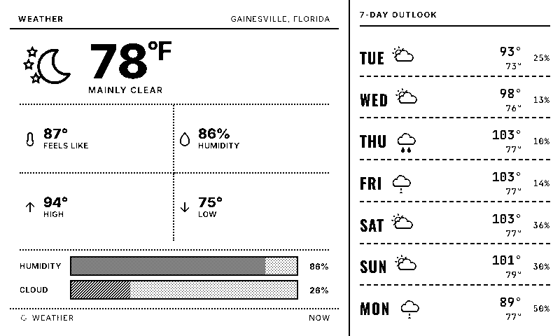

# Hi, I'm Huy 👋

I build things end-to-end — hardware, firmware, servers, and the UI on top — and I learn by shipping.

## 🖥️ E-Ink Dashboard

A server-rendered, newspaper-style dashboard for Waveshare 7.5" e-paper panels driven by an ESP32.

The ESP32 is deliberately dumb: it wakes, downloads a packed 1-bit (or two-plane 3-color) image, paints it, and deep-sleeps. Everything else — 28 widgets, a drag-and-drop React editor, screen scheduling, ordered-dither tone/texture system, per-device fleet API, OTA firmware from CI, captive-portal WiFi setup — lives on a Node server.

  

Highlights:
- **Pixel pipeline** — Puppeteer screenshot → Sharp threshold → MSB-packed planes; a bit-accurate row-rotation compensates a hardware column-offset quirk of the physical panel.
- **Dither system** — 7-step gray ramp plus equal-darkness texture weaves (diagonal / lines / cross-hatch) so adjacent fills stay readable in pure 1-bit ink.
- **Self-healing fleet** — devices enroll themselves, report failures from RTC-buffered logs when they recover, and re-enroll automatically if the server loses the roster.
- **Webhook widget** — POST any JSON to an endpoint and it renders on the panel (TRMNL-private-plugin style).

*Repo is private for now — happy to share details or a demo.*

## 🔭 Also building

- **project-bull** — compare any US stock's price against its fundamentals (revenue, EPS) as a public data viz.
- **A C++ game engine** — math/window/renderer from scratch, to understand what the engines I use are doing.

## 🧰 Tools I reach for

`Node.js` · `Express` · `React` · `Puppeteer` · `Sharp` · `C++ / Arduino (ESP32)` · `Railway` · `GitHub Actions`
